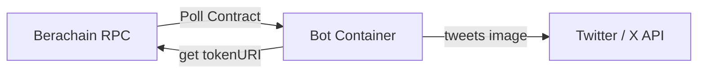

<V1>

Below is a **Technical Specification** for implementing the Bouns Twitter posting bot. This spec details the overall architecture, data flows, edge cases, and deployment steps so a developer can implement and deploy the solution.

---

# Bouns Bot: Twitter Posting Automation

## 1. Purpose

The **Bouns Bot** automatically tweets an image of each newly minted Boun NFT on Berachain. Specifically:

1. **Detect** when new NFTs (Bouns) are minted.  
2. **Fetch** each NFT’s on-chain SVG image.  
3. **Convert** the SVG to PNG (if necessary).  
4. **Tweet** the image with minimal text.

### Core Requirements
- **Stateless**: No long-term database or file storage.  
- **Dockerized**: Runs as a single container, easily deployed.  
- **Poll-based**: Checks every 5 minutes (to save RPC credits).  
- **Multiple Mints**: Can handle the case where 2 NFTs mint at once.  

---

## 2. High-Level Architecture



1. **Bot Container** runs continuously.  
2. Every 5 minutes, it calls `totalSupply()` on the NFT contract via the Berachain RPC.  
3. If the supply has increased, it fetches each newly minted token via `tokenURI(tokenId)`, decodes the SVG, converts it to PNG, and calls the Twitter API to post a tweet with the image.  

---

## 3. Detailed Implementation

### 3.1 Data Flow

1. **Initialize**  
   - On startup, determine `oldSupply`. Either:
     - **Option A**: Set `oldSupply = 0` (which would tweet all existing tokens once).  
     - **Option B**: Set `oldSupply = contract.totalSupply()` to skip tweeting older tokens.  

2. **Loop (every 5 minutes)**  
   - Get `newSupply = contract.totalSupply()`.  
   - If `newSupply > oldSupply`:
     1. For each `tokenId` in `range(oldSupply+1, newSupply+1)`:
        - Fetch `tokenURI(tokenId)`.  
        - Decode the base64 JSON to find `"image": "data:image/svg+xml;base64,..."`.  
        - Decode the image to get raw SVG bytes.  
        - Convert SVG bytes to PNG.  
        - Post tweet with text, e.g. “New Boun minted! #X” and attach the PNG.  
     2. Update `oldSupply = newSupply`.  
   - Sleep for 300 seconds.  

3. **Stateless Behavior**  
   - We do **not** persist `oldSupply` to disk or DB. If the container restarts, it resets to the chosen initialization behavior.  
   - Accept that older missed tokens are not re-tweeted (Option B) or that older tokens are re-tweeted once after each restart (Option A). Choose which approach is best for your use case.

### 3.2 Contract Interaction

- **Method**: Use **Web3.py** (Python) or **ethers.js** (Node) to connect to the Berachain RPC.  
- **RPC Endpoint**: Provided via environment variable `RPC_URL`.  
- **Contract ABI**: Must include methods:  
  - `function totalSupply() returns (uint256)`  
  - `function tokenURI(uint256 tokenId) returns (string)`  

### 3.3 Decoding TokenURI

1. The contract returns a string like:  
   ```
   "data:application/json;base64,eyJuYW1lIjoiT..."
   ```
2. Remove prefix: `"data:application/json;base64,"`.  
3. Base64-decode the remainder → JSON object, e.g.:  
   ```json
   {
     "name": "Noun 1",
     "description": "...",
     "image": "data:image/svg+xml;base64,PHN2ZyB3a..."
   }
   ```
4. Extract the `image` field.  
5. Remove prefix `"data:image/svg+xml;base64,"`.  
6. Base64-decode to obtain **raw SVG** bytes.

### 3.4 Converting SVG to PNG

- **Python** example: [cairosvg](https://cairosvg.org/)  
  ```python
  import cairosvg

  png_bytes = cairosvg.svg2png(bytestring=svg_bytes)
  ```
- Store `png_bytes` in an in-memory buffer to pass to the Twitter API.

### 3.5 Tweeting

- **API Requirement**: Must first **upload media** to Twitter, then **reference media ID** in the tweet.  
- **Tools**: [Tweepy](https://docs.tweepy.org/en/stable/) or custom requests to [upload.twitter.com](https://upload.twitter.com/1.1/media/upload.json).  
- **Workflow**:
  1. `media_upload` call with `png_bytes` → returns `media_id`.  
  2. `update_status` with `media_ids=[media_id]` and text content.

### 3.6 Handling Multiple Mints

- If `oldSupply = 10` and `newSupply = 12`, loop `token_id` in `[11, 12]`.  
- Tweet each one in sequence.

---

## 4. Technology Choices

1. **Language**: Python 3.10+ (or Node.js).  
2. **Libraries** (Python):
   - `web3==6.x`  
   - `tweepy==4.x`  
   - `cairosvg==2.x`  
3. **Container**: Built from `python:3.11-slim` as a lightweight base.

---

## 5. Docker & Deployment

### 5.1 Dockerfile

```dockerfile
# Example Dockerfile for Python implementation
FROM python:3.11-slim

WORKDIR /app
COPY requirements.txt .
RUN pip install --no-cache-dir -r requirements.txt
COPY . .

CMD ["python", "main.py"]
```

### 5.2 Required Environment Variables

- `RPC_URL`: Berachain RPC endpoint (e.g. https://....).  
- `CONTRACT_ADDRESS`: The Bouns NFT contract address.  
- `CONTRACT_ABI`: (Optionally packaged in code or pulled dynamically).  
- `TWITTER_API_KEY`: From your Twitter developer portal.  
- `TWITTER_API_SECRET`: From your Twitter developer portal.  
- `TWITTER_ACCESS_TOKEN`: From your Twitter developer portal.  
- `TWITTER_ACCESS_SECRET`: From your Twitter developer portal.  

You can set these in a `.env` file or directly when running the container:

```bash
docker run -d \
  --name bouns-bot \
  -e RPC_URL="https://paid-berachain-rpc" \
  -e CONTRACT_ADDRESS="0xContract..." \
  -e TWITTER_API_KEY="..." \
  -e TWITTER_API_SECRET="..." \
  -e TWITTER_ACCESS_TOKEN="..." \
  -e TWITTER_ACCESS_SECRET="..." \
  bouns-bot
```

### 5.3 main.py (Pseudocode)

```python
import os, time, base64, io, json
from web3 import Web3
import tweepy
import cairosvg

# 1. ENV VARS
RPC_URL = os.getenv("RPC_URL")
CONTRACT_ADDRESS = os.getenv("CONTRACT_ADDRESS")
# For brevity, assume CONTRACT_ABI is loaded from a file or hardcoded.
CONTRACT_ABI = [...]
TWITTER_API_KEY = os.getenv("TWITTER_API_KEY")
TWITTER_API_SECRET = os.getenv("TWITTER_API_SECRET")
TWITTER_ACCESS_TOKEN = os.getenv("TWITTER_ACCESS_TOKEN")
TWITTER_ACCESS_SECRET = os.getenv("TWITTER_ACCESS_SECRET")

# 2. Setup Web3 + Contract
web3 = Web3(Web3.HTTPProvider(RPC_URL))
contract = web3.eth.contract(address=CONTRACT_ADDRESS, abi=CONTRACT_ABI)

# 3. Setup Twitter API
auth = tweepy.OAuth1UserHandler(
    TWITTER_API_KEY, TWITTER_API_SECRET,
    TWITTER_ACCESS_TOKEN, TWITTER_ACCESS_SECRET
)
api = tweepy.API(auth)

def get_svg(token_uri):
    # Remove "data:application/json;base64,"
    json_prefix = "data:application/json;base64,"
    if token_uri.startswith(json_prefix):
        token_uri = token_uri[len(json_prefix):]

    # Decode JSON
    decoded_json = base64.b64decode(token_uri).decode("utf-8")
    metadata = json.loads(decoded_json)

    # Extract image field
    image_data = metadata["image"]
    svg_prefix = "data:image/svg+xml;base64,"
    if image_data.startswith(svg_prefix):
        image_data = image_data[len(svg_prefix):]

    # Decode SVG
    svg_bytes = base64.b64decode(image_data)
    return svg_bytes

def svg_to_png(svg_bytes):
    return cairosvg.svg2png(bytestring=svg_bytes)

def post_tweet(png_data, token_id):
    # Convert bytes to file-like object
    file_obj = io.BytesIO(png_data)
    # Upload media
    media = api.media_upload(filename=f"boun_{token_id}.png", file=file_obj)
    # Post tweet
    text = f"New Boun minted! #{token_id}"
    api.update_status(status=text, media_ids=[media.media_id])
    print(f"Tweeted token #{token_id}")

def main_loop():
    # Initialize old supply
    old_supply = contract.functions.totalSupply().call()  # skip existing tokens

    while True:
        try:
            new_supply = contract.functions.totalSupply().call()
            if new_supply > old_supply:
                for token_id in range(old_supply+1, new_supply+1):
                    # Fetch URI, decode, convert, tweet
                    uri = contract.functions.tokenURI(token_id).call()
                    svg_bytes = get_svg(uri)
                    png_bytes = svg_to_png(svg_bytes)
                    post_tweet(png_bytes, token_id)
                old_supply = new_supply
        except Exception as e:
            print("Error:", e)

        # Sleep 5 minutes
        time.sleep(300)

if __name__ == "__main__":
    main_loop()
```

---

## 6. Edge Cases & Considerations

1. **Multiple Mints**:  
   - Looping from `oldSupply+1` to `newSupply` handles simultaneous mints.

2. **Container Restart**:  
   - On restart, `old_supply` is re-initialized to `totalSupply()`. This **skips** tweeting older tokens minted while offline.  
   - If you want to tweet missed tokens after downtime, you can store `old_supply` externally or fetch the last minted token from logs. This adds complexity and state.  

3. **RPC Costs**:  
   - Polling every 5 minutes → ~288 calls/day to `totalSupply()`. Additional calls for each minted token’s `tokenURI()`. Ensure you have enough RPC credits.  

4. **Twitter Rate Limits**:  
   - Posting once or twice a day is typically safe.  

5. **Logging & Monitoring**:  
   - Consider adding logs for each step (poll success, tweet success, errors).  
   - Optionally integrate a log aggregator if deploying at scale.

---

## 7. Testing

1. **Local Test**:  
   - Use a local Ethereum test environment (e.g., Ganache, Hardhat) or a testnet environment for Berachain if available.  
   - Mint a few tokens, confirm the bot tweets them as expected.  

2. **Production**:  
   - Deploy the container to your cloud VM.  
   - Ensure environment variables are correctly set.  
   - Monitor logs for successful tweets and no repeated errors.

---

## 8. Maintenance Plan

- **Library Upgrades**: Keep an eye on Web3.py, Tweepy, CairoSVG versions.  
- **Regenerate** or **rotate** Twitter API keys and RPC credentials if needed.  
- **Error Handling**: If RPC or Twitter fail, the code logs an error and tries again after 5 minutes.

---

# Final Summary

**The Bouns Bot** is a stateless Docker container that polls the NFT contract on Berachain, detects newly minted tokens, fetches on-chain SVG artwork, converts it to PNG, and posts the image to Twitter. The above **Technical Specification** outlines the entire flow, from contract interaction to Docker deployment, ensuring your developer can implement and maintain it efficiently.

</V1>

<V2>

Below is an **updated Technical Specification** that reflects the new requirement to detect newly minted Bouns using the **Auction contract**—rather than the NFT’s `totalSupply()`—and to account for the possibility that auctions can end with no bidders and burned Bouns.

---

# **Bouns Bot: Revised Technical Specification**

## 1. Overview

- **Goal**: Tweet an image of each newly minted Boun NFT on Berachain.  
- **Problem with `totalSupply()`**: Because a Boun can be burned (if unauctioned), the total NFT supply may **decrease** before increasing again, which breaks our previous polling strategy.  
- **Solution**: Monitor the **Auction contract** for new auctions. Specifically, use the `auction()` function, which returns the current auction data (including the latest `nounId`). When `nounId` increments, we know a new Boun has been minted.

---

## 2. Auction Contract: Tracking New Bouns

### 2.1 Auction Contract Endpoint

- **Contract**: Bouns Auction contract.  
- **Function**: 
  ```solidity
  function auction() 
    view 
    returns (
      uint256 nounId,
      uint256 amount,
      uint256 startTime,
      uint256 endTime,
      address payable bidder,
      bool settled
    );
  ```
  - **`nounId`**: Identifies the Boun being auctioned.  
  - **`endTime`**: Timestamp after which the auction is complete, though settlement can happen any time after.  

### 2.2 Logic to Detect New Mints

1. **Current Auction Polling**  
   - The bot periodically calls `auction()` to retrieve the current `nounId`.  
   - If the returned `nounId` is **greater** than the last known `nounId`, this indicates a **new Boun** has been created (a new auction started).
2. **Auction Completion Constraint**  
   - No new Boun is minted until the **previous** auction is settled.  
   - Hence, once you see `endTime` pass (and eventually `settled == true`), the next call to `auction()` should reflect a **new** `nounId` if a new auction has begun.  
3. **Reduced Polling**  
   - Because a new Boun is only minted **after** settlement, you can skip intensive polling until **after** `endTime`.  
   - For example, you might poll more frequently near `endTime` to detect settlement, or poll less often until you see that the current auction is settled.  

---

## 3. Interaction with the NFT Contract

Even though you no longer rely on the NFT’s `totalSupply()`, you still need the **SVG** from the NFT contract:

1. **Obtain `nounId`** from the Auction contract.  
2. **Call `tokenURI(nounId)`** on the Bouns NFT contract to retrieve the NFT metadata.  
   - This metadata contains the `image` field with the base64-encoded SVG.  
3. **Convert the SVG to PNG** for the tweet, as per your existing approach.

---

## 4. Proposed High-Level Flow

1. **Initialize**  
   - Retrieve the **current** `auction()` data (which includes a `nounId`, `endTime`, etc.).  
   - Store `lastKnownNounId` as the `nounId` from this call.

2. **Main Loop**  
   - **A. Auction Monitoring**  
     - Check the **current** auction by calling `auction()`.  
     - If `nounId` > `lastKnownNounId`, a **new** Boun has appeared (new auction):
       1. Fetch the SVG from the NFT contract using `tokenURI(nounId)`.
       2. Convert the SVG to PNG.
       3. Tweet the result (with text, e.g. “New Boun minted! #nounId”).
       4. Update `lastKnownNounId = nounId`.  
   - **B. Poll Frequency**  
     - If the current auction’s `endTime` has **not** passed, you can poll less frequently (since no new Boun will mint until the current auction finishes and is settled).  
     - Once you pass `endTime`, you may poll more frequently to detect the settlement event (which leads to the next mint).

3. **Statelessness & Edge Cases**  
   - If the container restarts, it could initialize `lastKnownNounId` to the current `nounId` from the auction contract. This avoids re-tweeting older Bouns.  
   - If you want to catch any new Bouns minted while the bot was offline, you could compare the on-chain logs or handle that in logic, but that introduces state or event lookbacks.

---

## 5. Contract Interactions

1. **Auction Contract**  
   - **Address**: The known Bouns Auction contract address.  
   - **ABI**: Must include the `auction()` method signature given above.  

2. **NFT Contract**  
   - **Address**: The known Bouns NFT contract address.  
   - **Method**: `tokenURI(uint256 _tokenId) returns (string)`.  
   - The returned string is a `data:application/json;base64,...` that includes `"image": "data:image/svg+xml;base64,..."`.

---

## 6. Implementation Notes (No Code)

- **Track `nounId`**:  
  - Maintain a local variable (e.g., `lastKnownNounId`). If `auction().nounId` > `lastKnownNounId`, that indicates the new NFT.  
- **Reduce Polling**:  
  - Use `auction().endTime` to determine whether to poll more or less frequently. 
  - For example, poll once per hour when far from `endTime`, then every few minutes around `endTime` until the auction is settled.  
- **Image Posting**:  
  - Same logic for decoding the base64 JSON → extracting and converting the SVG → uploading PNG to Twitter.  
- **Optional**:  
  - If you want an additional check that the auction is “settled” before tweeting, you can also inspect `auction().settled`. The new Boun typically appears only after settlement triggers the new auction creation.  
  - The time between `endTime` and actual settlement can be indefinite, so handle the possibility of a delay.

---

## 7. Summary of Changes from the Previous Spec

1. **No Longer Using `totalSupply()`**:  
   - We cannot rely on an incrementing supply due to burn mechanics for unauctioned Bouns.  
2. **Using `nounId` from the Auction Contract**:  
   - Poll `auction()` to detect new mints via an incremented `nounId`.  
3. **Two Contracts**:  
   - **Auction** contract (to detect newly minted Bouns).  
   - **NFT** contract (to fetch the actual SVG).  
4. **Improved Polling Strategy**:  
   - Option to use `endTime` to reduce polling frequency when the auction is ongoing.  
   - Increase polling around or after `endTime` to detect settlement and the next minted Boun.

---

**Conclusion:**  
The Bouns Bot should track the **Auction contract**’s `nounId` rather than the NFT contract’s `totalSupply()`. When a new `nounId` is detected, fetch and tweet the corresponding NFT image from the Bouns NFT contract. This approach circumvents problems with burned tokens and ensures accurate detection of newly minted Bouns.

</V2>

